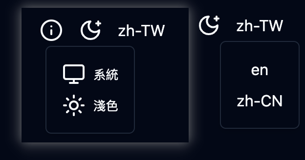
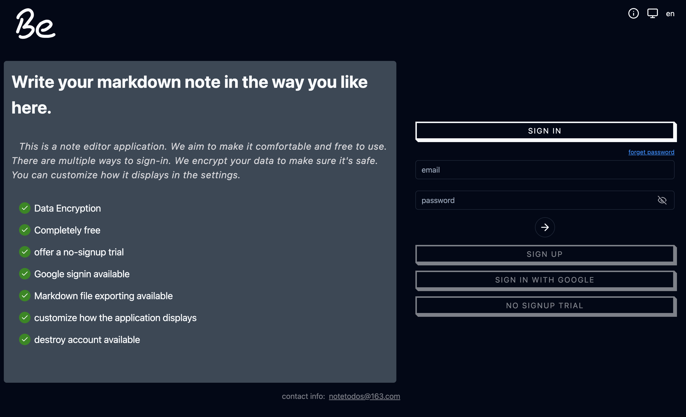
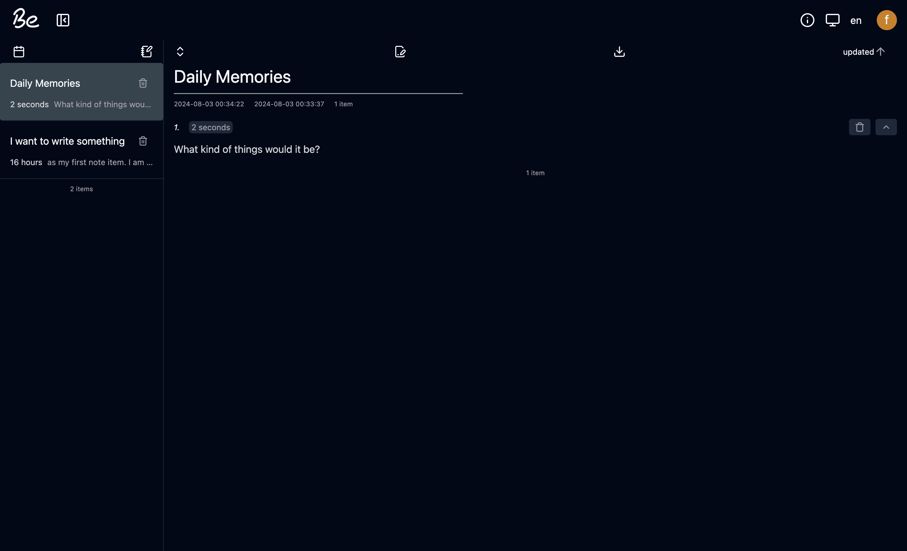
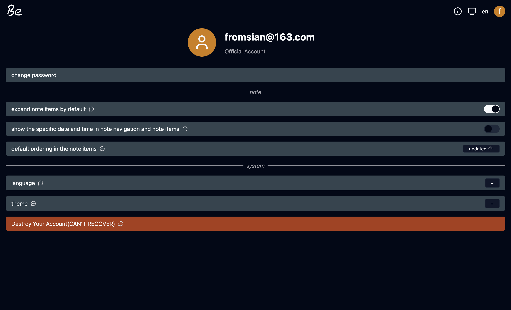
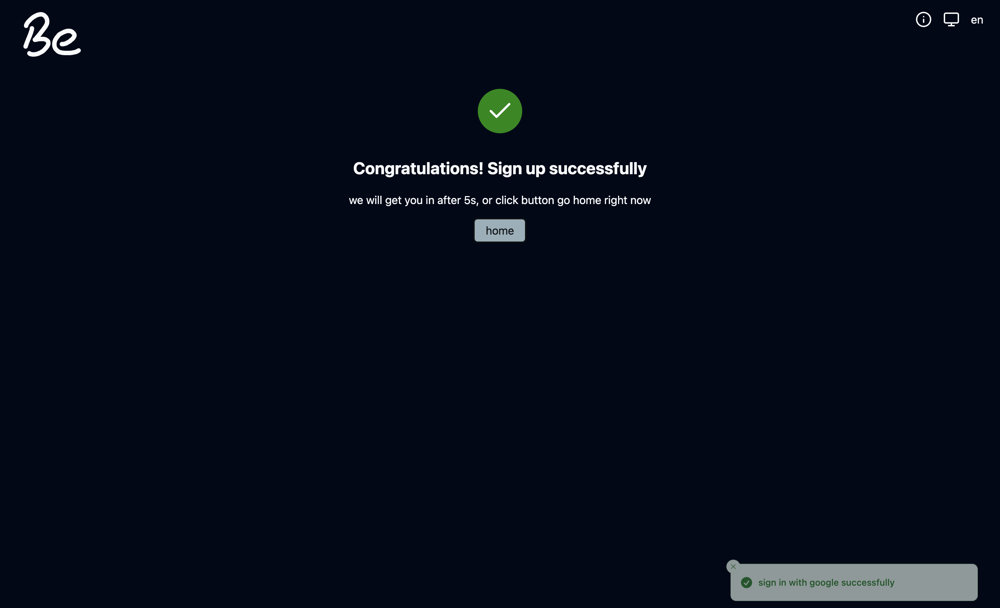
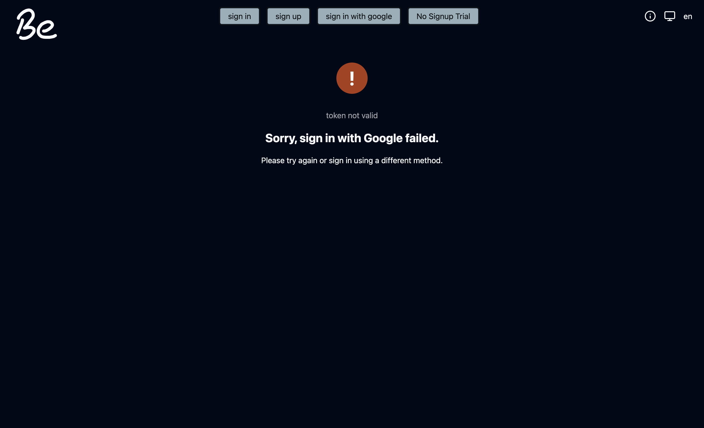
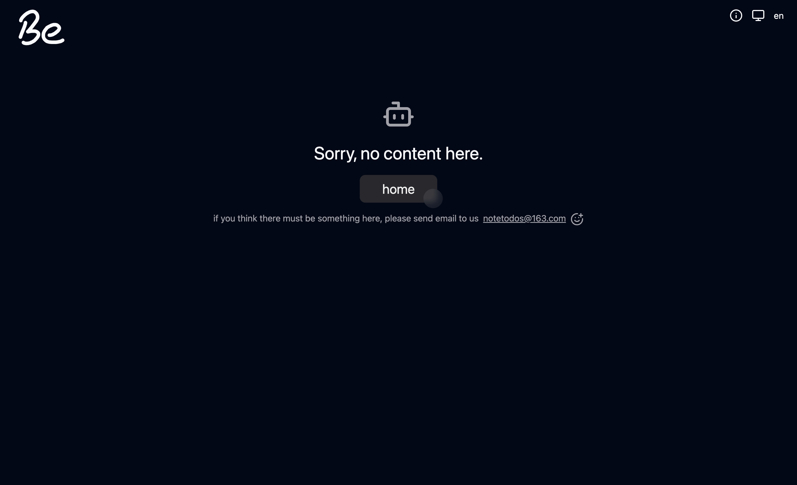
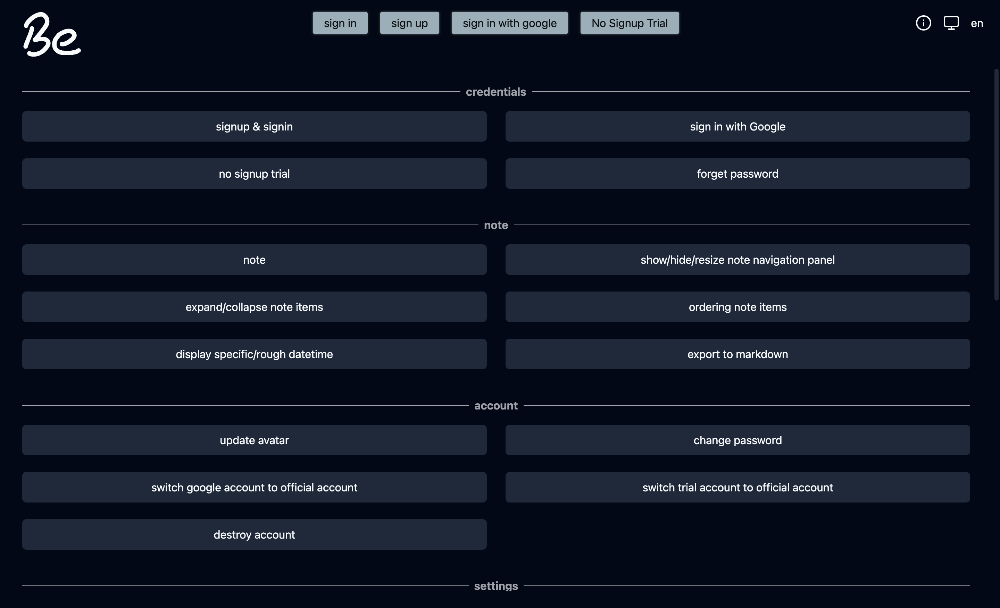

# be markdown note front end

deployment: https://be-markdown-notes.vercel.app/welcome

This project is front-end, the back-end is https://github.com/fromSian/all-in-one-note-back

## React + TypeScript + Vite + react-i18next + tailwind + shadcn/ui + React Router + Redux Toolkit + ...

- React as user interfaces library
- Vite as the build tool
- TypeScript language
- react-i18next to implement internationalization
- Tailwind CSS to write CSS
- shadcn/ui for some ui components(https://ui.shadcn.com/docs)
- React Router for routing
- Redux Toolkit to manage global state
- react-image-crop to crop uploaded images
- zod for validating inputs
- tiptap editor for markdown editing

## features

- responsive layout
- sign in with google
- support for trial
- i18next
- customizes note display, can decide whether show specific datetime or rough, can decide what ordering in default, can decide whether to expand or collapse in default.
- data encryption, your password and note content will be encrypted.
- scroll to fetching data, using IntersectionObserver with backend custom list query api.
- axios error handler

## Designs & Functions

### common

- i18next & language switcher, support English, Simplified Chinese and Traditional Chinese.
- theme switcher, support theme based on system, dark and light.

### welcome page

- official account sign in and sign up
- sign in with google
- no signup trial. This is for trial using, when click, will enter the application without any sign-up or sign-in. And This trial will be expired in 1 hour.
- forget password

### note page

This is the note editor and display. Navigation Panel in left, the right is the note content.

- scrolling to fetching data
- hide/show/resize navigation panel
- note edit things
- export note as markdown file

### account settings page

- avatar image crop
- change password
- google account to official account
- trial account to official account
- note display settings
- language/theme settings
- destroy account

### google success sign in page

- the back-end will redirect to this page when sign in with google successfully. And in this page will revalidate the token.

### google fail sign in page

- the back-end or the google-success-page will redirect to when sign in with google failed or the token is not valid.

### not-found page

### introduce page

- some function description
- usage example video

# resources

Besides, these resources are a great help to me.

- svg animate: https://svgartista.net/
- svg to jsx: https://svg2jsx.com/
- color choosing: https://mycolor.space/
- video compress: https://www.freeconvert.com/video-compressor
- image conpress: https://www.freeconvert.com/image-compressor
- icons: https://lucide.dev/icons/
- vercel for deploying: https://vercel.com/
- auto grow textarea: https://css-tricks.com/the-cleanest-trick-for-autogrowing-textareas/
- ui design: https://refero.design/

and so many question-anwser in stackoverflow, github, dev...
